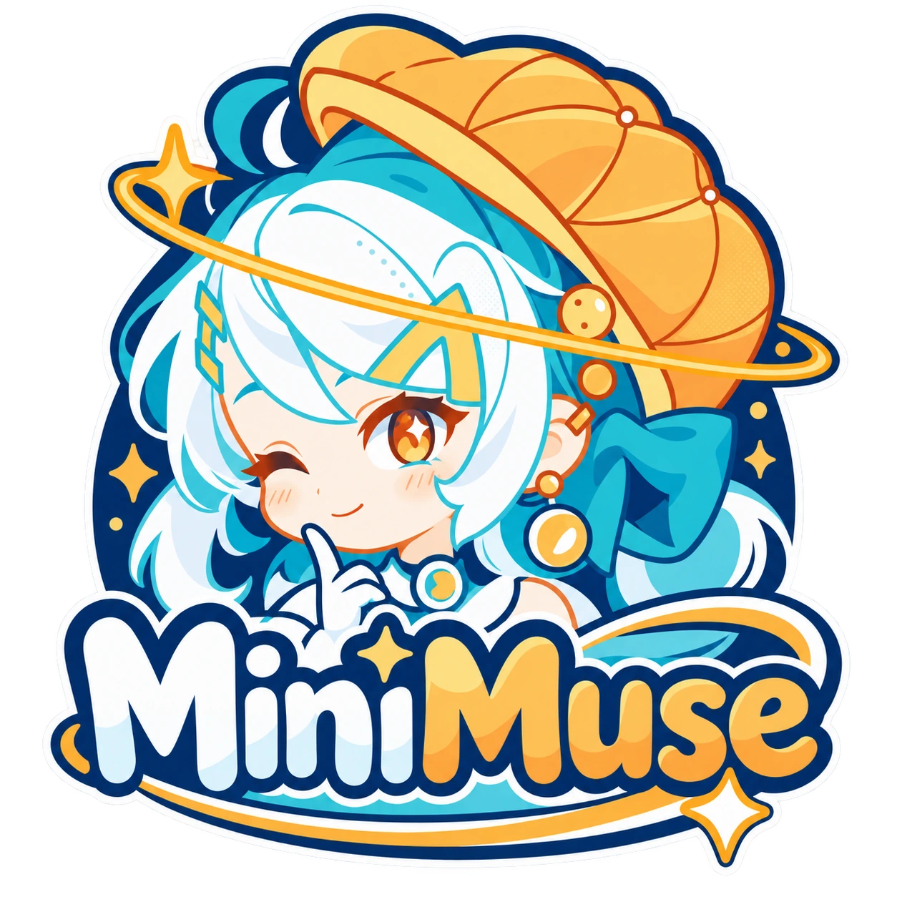
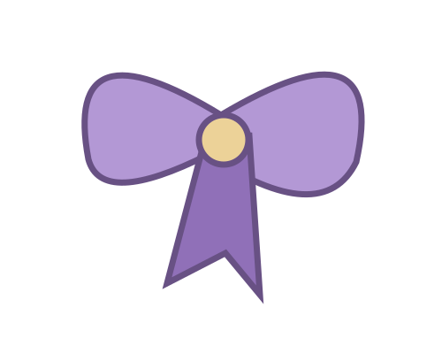
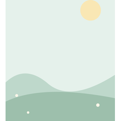

# MiniMuse Tools · 图片编辑与素材工作台

<p align="center">
  
</p>

<p align="center">
  <a href="https://minimusetools.com/">访问网站</a> ·
  <a href="https://minimusetools.com/asset-studio/?mode=edit">上传图片并编辑</a> ·
  <a href="https://minimusetools.com/asset-studio/?mode=create">体验素材创作</a>
</p>

MiniMuse Tools 是面向 MiniMuse 玩家和 OC 创作者的独立浏览器工具。核心是**编辑和修复用户上传的图片**：处理背景、局部换色、调整服饰与发饰素材、组合图层，再下载单件或完整效果图。也提供少量原创及许可素材用于创作。

本仓库保存网站的 **out 静态构建产物**，用于 Cloudflare Workers Static Assets 部署。

## 网站与常用入口

| 入口 | 地址 |
|---|---|
| 正式网站 | https://minimusetools.com/ |
| 完整工作台 | https://minimusetools.com/asset-studio/ |
| Quick Edit | https://minimusetools.com/tools/custom-asset-prep/ |
| 去白底教程 | https://minimusetools.com/guides/remove-white-background/ |
| 自定义服饰 | https://minimusetools.com/guides/custom-clothes/ |
| 自定义头发 | https://minimusetools.com/guides/custom-hair/ |
| 素材导入指南 | https://minimusetools.com/guides/how-to-import-custom-assets/ |
| 官方游戏下载入口 | https://minimusetools.com/download/ |
| GitHub 静态仓库 | https://github.com/mooyu-king/minimuse-out |

## 图片修复：从一处修改开始

<p align="center">
  
  
</p>

*原创示意图：棋盘格用于表示透明预览，不会写入导出的透明 PNG。*

- 移除纯色或接近纯色的背景，调节颜色容差。
- 检查透明区域、空白边距与疑似白边，调整羽化和边缘修复。
- 使用轮廓、魔棒、选区画笔及擦除／恢复进行手动修正。
- 针对局部调整颜色，使用 Before/After 和不同背景检查结果。

复杂背景需要手动处理；工具不会自动识别全部角色部件，也不会补全被衣服或发饰遮挡的像素。

## 图层组合：服饰、发饰与背景

<p align="center">
  
  
  
</p>

*以上为本站原创素材示例，并非从游戏中提取的部件。*

上传独立 PNG 后可以移动、缩放、旋转、翻转和排序，调整显示状态与透明度。配色可保存为变体，图层可组合成完整效果图。参考轮廓仅用于对齐，不进入导出。

创作只是入口之一：无需完成整个角色，修改好一张素材即可下载。

## 导出与本地项目

| 输出 | 用途 |
|---|---|
| 单件 PNG | 保存一张处理后的素材 |
| 完整 PNG / JPG | 保存组合后的平面效果图 |
| 素材 ZIP | 整理独立素材、说明和必要的来源信息 |
| .mmstudio 项目备份 | 保存可继续编辑的图层、源图与设置 |

图片处理在浏览器本地完成。设备自动保存可选，项目备份由用户主动下载。清理浏览器数据可能删除设备保存的项目；不同域名的设备存储不共享。

ZIP 是素材整理包，**不是 MiniMuse 官方游戏安装包或角色格式**。解压后在游戏中逐项导入 PNG，并重新检查位置与大小。合成整图不会自动变成游戏内可编辑角色。

网站加载访问统计和可选播放的 YouTube 视频，详见 [隐私政策](https://minimusetools.com/privacy/)。编辑器不将用户选择的图片或项目内容附加到统计事件中。

## 本地构建：保留 .git 与 README

在源码项目目录执行，不能在本静态仓库中运行 Next.js 构建：

```powershell
Set-Location 'D:\03_website\20-minimuse'
$env:npm_config_cache = 'D:\99_tool\npm-cache'
$env:TEMP = 'D:\99_tool\temp'
$env:TMP = 'D:\99_tool\tmp'
npm run build-preserve-git
if ($LASTEXITCODE -ne 0) { throw '构建失败，停止发布。' }
Test-Path '.\out\.git'
Test-Path '.\out\README.md'
```

脚本会先备份 out 下已有的 `.git` 和 README 文件，构建完成后恢复；构建报错也会尝试恢复。README 名称不区分大小写，可带扩展名。恢复失败会返回失败状态并保留项目内备份供检查。

不要手动删除 out，也不要用普通 `npm run build` 替代保留构建命令。首次不存在的 `.git` 或 README 不会凭空由保留逻辑生成。恢复机制不代表整份旧网站构建产物都已备份。

## GitHub → Cloudflare Workers 发布

完成构建后检查 Git 根目录与远端：

```powershell
Set-Location 'D:\03_website\20-minimuse\out'
git rev-parse --show-toplevel
git remote -v
git status --short
```

Git 根目录应以 `/20-minimuse/out` 结尾，origin 应指向 `mooyu-king/minimuse-out`。确认后提交发布：

```powershell
git add -A
git diff --cached --stat
git commit -m "Update MiniMuse Tools"
git push origin main
```

每条命令失败先处理，不强制覆盖远端历史。没有改动则无需新建提交。

本项目使用 Worker `minimuse-out`，Git 集成应连接本仓库 main 分支。仓库根目录已是静态文件，云端不需要再次编译 Next.js。根据实际部署配置，将仓库根目录作为静态资源目录。确认 GitHub 提交 SHA 对应的 Worker 部署成功后，再检查正式网站。

Worker 测试地址以控制台实际显示为准。正式域名通过 Worker 的自定义域绑定；Spaceship 负责注册续费，Cloudflare 管理 DNS 与 HTTPS。日常更新不需要再次修改名称服务器。

## 署名、许可与联系

MiniMuse Tools 不是 Studio Sirenia 官方产品，不代表官方背书。MiniMuse 名称与标志归其权利人所有，在此用于识别相关游戏，不作为可导出素材提供。

用户仅应处理自己原创或有权使用的图片。素材库文件遵循各自许可证；不能将某些素材的 CC0 声明理解为整个网站或 MiniMuse 标志均属于 CC0。

[About Us](https://minimusetools.com/about/) · [Privacy Policy](https://minimusetools.com/privacy/) · [Contact](https://minimusetools.com/contact/) · [Terms of Service](https://minimusetools.com/terms/) · [Copyright](https://minimusetools.com/copyright/)

联系邮箱：mooyuking@gmail.com
